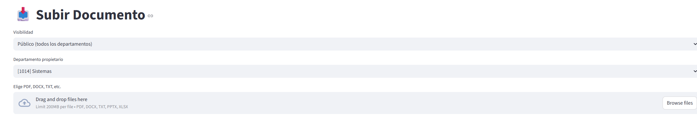

# 🧠 Hermes - Sistema de Conocimiento Interno con Control de Acceso

Hermes es un sistema RAG (Retrieval-Augmented Generation) local que permite a los empleados hacer preguntas sobre documentos internos, con **control de acceso basado en departamentos** y niveles de visibilidad.


## 🔒 Flujo de Permisos

El sistema gestiona el acceso a documentos mediante **dos metadatos**:

| Metadato | Valores | Descripción |
|---------|---------|-------------|
| **`access_level`** | `publico`<br>`departamento`<br>`privado` | Define quién puede acceder al documento |
| **`owner_department`** | `[1014] Sistemas`, `IT`, `Finanzas`, etc. | Departamento propietario del documento |

### Reglas de acceso

| Nivel de acceso | ¿Quién puede verlo? |
|----------------|---------------------|
| **Público** | ✅ Todos los departamentos |
| **Departamento** | ✅ Solo usuarios del mismo departamento |
| **Privado** | ✅ Solo usuarios del mismo departamento (propietario) |

> 💡 **Nota**: En la implementación actual, "privado" y "departamento" tienen el mismo comportamiento, pero están preparados para diferenciarse en futuras versiones (ej: usuarios específicos).

## 🚀 Cómo usar Hermes

### 1. Configurar tu perfil

1. Haz clic en **"👤 Mi Perfil"** en el menú lateral
2. Selecciona tu departamento
3. Pulsa **"💾 Guardar cambios"**


### 2. Subir documentos

1. Ve a **"📥 Subir Documento"**
2. Selecciona el nivel de visibilidad y departamento propietario
3. Sube uno o varios archivos
4. El sistema **detectará automáticamente duplicados**



### 3. Consultar documentos

1. Ve a **"💬 Chat"**
2. Escribe tu pregunta en español
3. Recibirás una respuesta basada **solo en documentos accesibles para tu departamento**
4. Las **fuentes** se muestran en un expander debajo de la respuesta


### 4. Gestionar documentos

1. Ve a **"📚 Biblioteca"**
2. Verás todos los documentos accesibles para tu departamento
3. Puedes **eliminar documentos** con el botón 🗑️
4. La eliminación borra tanto el archivo como sus metadatos

## 📁 Estructura de archivos

Al subir un documento `manual.pdf`, se crean automáticamente:


### 🧠 INSTALACIÓN ####

# Clonar el repositorio
   ```bash
git clone https://github.com/marferfer/hermes.git
cd hermes

# Crear entorno virtual
   ```bash
python -m venv venv
source venv/bin/activate  # Linux/Mac
# o
   ```bash
venv\Scripts\Activate.ps1  # Windows

# Instalar dependencias
   ```bash
pip install -r requirements.txt

# Descargar modelo
   ```bash
ollama pull llama3

# Ejecutar la aplicación
   ```bash
streamlit run app.py


## 🚀 Despliegue en servidor corporativo

### Requisitos
- Windows Server 2016+ o Linux
- Python 3.10+
- 16 GB RAM recomendados
- Acceso a Internet (para descargar dependencias)

### Pasos de instalación
1. **Clonar el repositorio**
   ```bash
   git clone https://github.com/tu-empresa/hermes.git
   cd hermes
